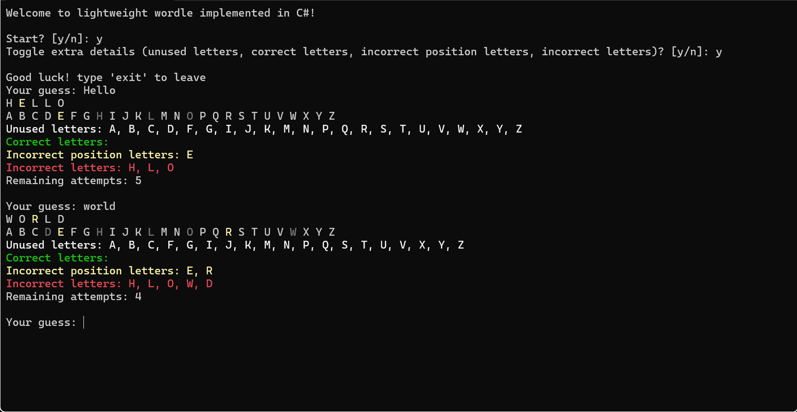

# Wordle in C# 
A lightweight Wordle game built as a C# console application. 

## Download 
You can download the executable files from the [releases](https://github.com/legelff/Wordle-in-Csharp/releases) section. 

## How to Run 
1. **Windows**:
   - Download the `x64` release.
   - Navigate to the folder where you downloaded the executable.
   - Extract the zip file
   - Run the application by double-clicking on the .exe file.
2. **MacBook**:
   - Download the `arm64` release.
   - Navigate to the folder where you downloaded the executable.
   - Extract the zip file
   - Run the application by double-clicking on the .exe file.
3. **Linux**:
   - Download the `linux-x64` release.
   - Navigate to the folder where you downloaded the executable.
   - Extract the zip file
   - Run the application by double-clicking on the .exe file.

## Features 
- Play the classic Wordle game in your console.
- Lightweight and fast.
- Compatible with multiple platforms.

## Acknowledgements
- Inspired by the original Wordle game.
- Thanks to [frontendexpert](https://api.frontendexpert.io/api/fe/wordle-words) for the word list.

## Contact
If you have any questions or suggestions, feel free to reach out:

- Email: business@l145.be
- LinkedIn: [LinkedIn](https://www.linkedin.com/in/aryan-shah-752364295/)
- GitHub: legelff
